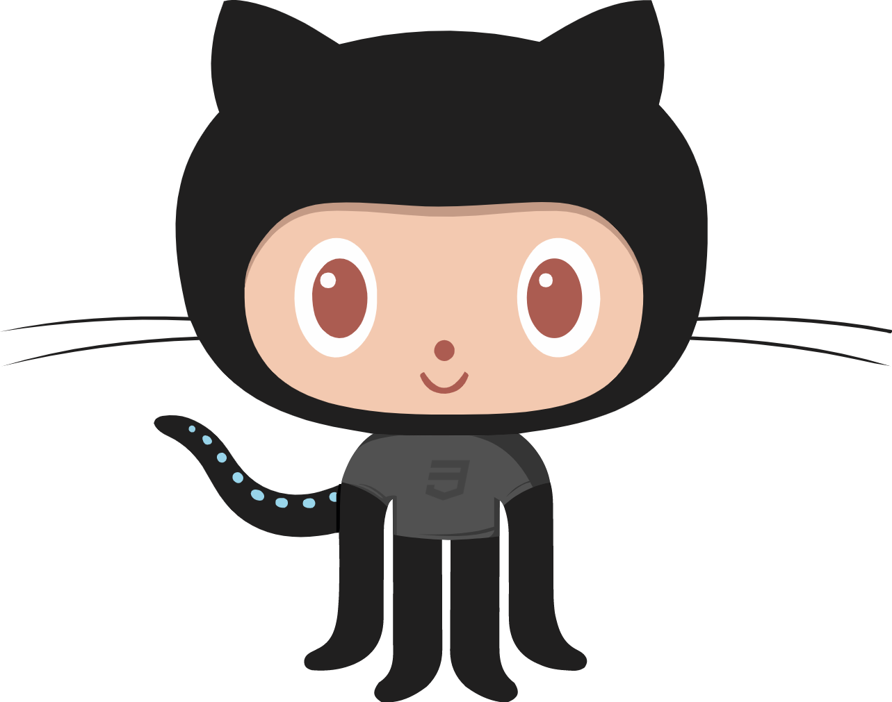

### Hi there 👋

<!--
**FloatinggOnion/FloatinggOnion** is a ✨ _special_ ✨ repository because its `README.md` (this file) appears on your GitHub profile.

Here are some ideas to get you started:
-->

- 🔭 I’m currently working on backedn projects with Django and Django REST Framework
- 🌱 I’m currently learning embedded systems programming and IoT
- 👯 I’m looking to collaborate on backend and fullstack projects
- 💬 Ask me about backend development (I think), and basically anything about tech. I love to learn
- 📫 How to reach me: Email: jesseosems123@gmail.com | IG: @noinspirationnoname |
- 😄 Pronouns: He/Him
<!--
- ⚡ Fun fact: ...
- 🤔 I’m looking for help with ...
-->

Check out my Octo-Lang

